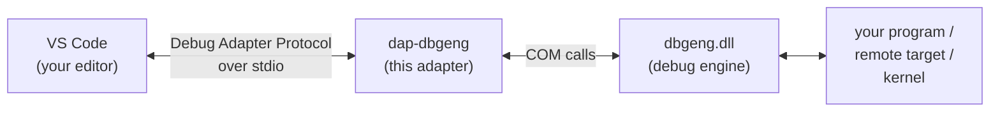

# Debug Adapter for WinDbg

Debug **native Windows code** - C and C++ programs, services, and even the
Windows **kernel** - straight from Visual Studio Code, using the same engine
that powers WinDbg.

This adapter (`dap-dbgeng`) is a small program that sits between your editor and
the Windows debug engine (`dbgeng.dll`). Your editor speaks the
[Debug Adapter Protocol](https://microsoft.github.io/debug-adapter-protocol/)
(DAP); the adapter translates that into debugger commands and sends the results
back. The upshot: you set breakpoints, step through code, and inspect variables
with the familiar VS Code debugging UI, but the real work is done by the
battle-tested Windows debugger underneath.

---

## What you can do with it

- **[Debug a local program](scenarios/local-debugging.md)** - launch an `.exe`
  under the debugger, break at entry, set breakpoints, step, and inspect locals.
- **[Debug a running process](scenarios/attach.md)** - connect to a program that
  is already running by its process ID.
- **[Debug a remote process](scenarios/remote-debugging.md)** - debug a process on
  another machine over the network using a process server.
- **[Debug a Windows driver](scenarios/driver-debugging.md)** - attach to a
  kernel-debug-enabled target (a VM or second machine) to debug kernel-mode
  drivers.

---

## How it fits together

You configure all of this through a **`launch.json`** file in your workspace -
the same file VS Code uses for every debugger. The rest of this guide is about
writing that file for each scenario.

!!! tip "New here? Start with setup."
    If you haven't pointed VS Code at the adapter yet, begin with
    **[Getting started](getting-started.md)**. It walks you through the one-time
    setup and your very first debugging session.

---

## Requirements at a glance

| You need | Why |
| --- | --- |
| **Windows** (x64) | The adapter drives `dbgeng.dll`, which is Windows-only. |
| **Visual Studio Code** | The editor that hosts the debugging UI. |
| **The Debug Adapter for WinDbg extension** | Bundles the adapter, so there's nothing extra to build or install. See [Getting started](getting-started.md). |
| **Debugging Tools for Windows** | Provides `dbgeng.dll` (and `dbgsrv.exe` for remote debugging). Installed with the Windows SDK / WDK, or as a standalone component. |
| **PDB symbols for your target** | So the debugger can map addresses back to your source and variables. |

!!! note "What this guide does *not* cover"
    This is a **usage** guide - how to configure and run debugging sessions. It
    does not cover building the adapter from source (see the project `README.md`)
    or how the adapter is implemented internally.
