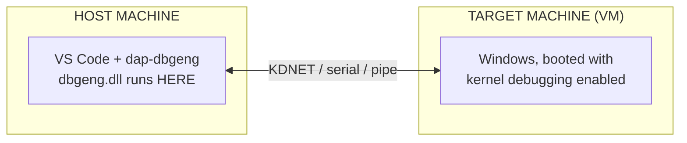

# Debug a Windows driver

Debug **kernel-mode drivers** (and the OS around them). Driver debugging is
whole-machine, so you need two: a **host** (VS Code + adapter) and a **target**
machine being debugged - almost always a VM.

<div class="video-embed">
  <iframe src="https://www.youtube-nocookie.com/embed/m1E5AsglKiQ" title="Debug a Windows kernel driver with dap-dbgeng" loading="lazy" allow="accelerometer; autoplay; clipboard-write; encrypted-media; gyroscope; picture-in-picture; web-share" allowfullscreen></iframe>
</div>



!!! danger "Use a throwaway target"
    Kernel debugging halts the whole target at breakpoints and weakens its
    security posture. Use a disposable VM or dedicated test box.

## 1. Enable kernel debugging on the target

From an elevated prompt on the target, then **reboot**:

```cmd
bcdedit /debug on
bcdedit /dbgsettings net hostip:<HOST-IP> port:50005 key:1.2.3.4
```

## 2. Configure `launch.json` on the host

```json title=".vscode/launch.json"
{
  "name": "Debug driver (KDNET)",
  "type": "dbgeng",
  "request": "attach",
  "kernel": true,
  "connectionString": "net:port=50005,key=1.2.3.4"
}
```

- `kernel: true` selects kernel mode and makes `connectionString` a kernel
  transport.
- `connectionString` must match the target's `bcdedit` settings. There is no
  `processId` - the session is the whole machine.

### Connection string by transport

| Transport | `connectionString` |
| --- | --- |
| Network (KDNET) | `net:port=50005,key=1.2.3.4` |
| COM / serial (VM named pipe) | `com:port=\\.\pipe\kd,baud=115200,pipe,reconnect` |
| 1394 (FireWire) | `1394:channel=32` |
| USB | `usb:targetname=mytarget` |

See **[attach attributes](../reference/attach.md)** for all options. A full worked
example (build, load, and break on a driver) lives in `test-targets/sys/README.md`
in the repository.
