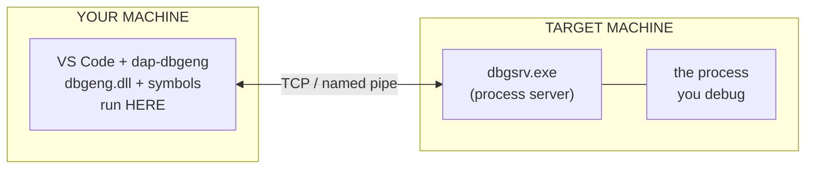

# Debug a remote process

Debug a **user-mode process on another machine**. You run a Windows process
server (`dbgsrv`) on the target; the debug engine and your symbols stay local.



## 1. Start the process server on the target

```cmd
dbgsrv -t tcp:port=5005
```

## 2. Configure `launch.json`

```json title=".vscode/launch.json"
{
  "name": "Attach on TARGETPC",
  "type": "windbg",
  "request": "attach",
  "processId": 4321,
  "connectionString": "tcp:port=5005,server=TARGETPC",
  "dbgengPath": "C:/Program Files (x86)/Windows Kits/10/Debuggers/x64/dbgeng.dll"
}
```

- `processId` is the PID **on the target machine**.
- `connectionString` is `tcp:port=<PORT>,server=<HOST>`, matching `dbgsrv` and the
  target's hostname/IP.

Everything else works like a [local attach](attach.md). See
**[attach attributes](../reference/attach.md)** for all options.
