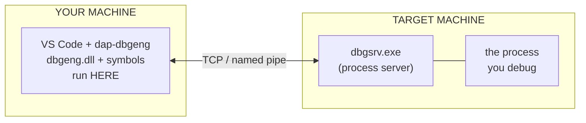

# Debug a remote process

Debug a **user-mode process on another machine**. You run a Windows process
server (`dbgsrv`) on the target; the debug engine and your symbols stay local.

<div class="video-embed">
  <iframe src="https://www.youtube-nocookie.com/embed/_YUhyKK2PlI" title="Debug a remote process with dap-dbgeng" loading="lazy" allow="accelerometer; autoplay; clipboard-write; encrypted-media; gyroscope; picture-in-picture; web-share" allowfullscreen></iframe>
</div>


```mermaid
flowchart LR
    subgraph host["YOUR MACHINE"]
        A["VS Code + dap-dbgeng<br/>dbgeng.dll + symbols<br/>run HERE"]
    end
    subgraph target["TARGET MACHINE"]
        B["dbgsrv.exe<br/>(process server)"]
        C["the process<br/>you debug"]
        B --- C
    end
    A <-->|"TCP / named pipe"| B
```

!!! warning "Remote debugging needs the Debugging Tools for Windows"
    The Store version of WinDbg cannot be used for `dbgsrv` connections: it does
    not allow loading its own `dbghelp.dll`, which the engine needs for them.
    Install the Debugging Tools (Windows SDK / WDK feature) and leave
    [`dbgengPath`](../reference/attach.md#dbgengpath) unset so the adapter finds
    them. Local and kernel debugging are unaffected.

## 1. Start the process server on the target

```cmd
dbgsrv -t tcp:port=5005
```

## 2. Configure `launch.json`

```json title=".vscode/launch.json"
{
  "name": "Attach on TARGETPC",
  "type": "dbgeng",
  "request": "attach",
  "processId": 4321,
  "connectionString": "tcp:port=5005,server=TARGETPC"
}
```

- `processId` is the PID **on the target machine**. Set it to
  `"${command:dap-dbgeng.pickProcess}"` to pick from the processes running on the
  `dbgsrv` host at debug time.
- `connectionString` is `tcp:port=<PORT>,server=<HOST>`, matching `dbgsrv` and the
  target's hostname/IP.

Everything else works like a [local attach](attach.md). See
**[attach attributes](../reference/attach.md)** for all options.

## Launch a process on the target

With `"request": "launch"` and the same `connectionString`, the adapter creates
the process **through the process server** - `program` and `cwd` are then paths
on the target, and `stopAtEntry` pauses at the entry point like a local launch:

```json title=".vscode/launch.json"
{
  "name": "Launch on TARGETPC",
  "type": "dbgeng",
  "request": "launch",
  "program": "C:\\myapp\\myapp.exe",
  "connectionString": "tcp:port=5005,server=TARGETPC",
  "stopAtEntry": true
}
```

## Attach by name / debug a remote service

`processName` (instead of `processId`) attaches to a process by executable
name, polling until it appears. Combined with `target.hooks`, this debugs a
Windows **service** end to end: F5 deploys the rebuilt binary over the
registered service binary, starts the service, and attaches as its process
spawns. The "Add Configuration..." snippet **dbgeng: Remote service** prefills
this:

```json title=".vscode/launch.json"
{
  "name": "Debug service on TARGETPC",
  "type": "dbgeng",
  "request": "attach",
  "processName": "myservice.exe",
  "connectionString": "tcp:port=5005,server=TARGETPC",
  "preLaunchTask": "Build",
  "target": {
    "host": "user@TARGETPC",
    "hooks": {
      "beforeSession": [
        "${dbgengScripts}/Deploy-Binary.ps1 -HostName '${host}' -Binary '${workspaceFolder}/build/Debug/myservice.exe' -ServiceName myservice",
        "${dbgengScripts}/Ensure-ProcessServer.ps1 -HostName '${host}' -Transport 'tcp:port=5005'"
      ],
      "onAttachRequest": [
        "${dbgengScripts}/Start-RemoteService.ps1 -HostName '${host}' -ServiceName myservice"
      ],
      "afterSessionEnd": [
        "${dbgengScripts}/Stop-RemoteService.ps1 -HostName '${host}' -ServiceName myservice"
      ]
    }
  }
}
```

Nothing has to be installed on the target for this: the
`Ensure-ProcessServer.ps1` hook copies the debugger there on first use and
starts `dbgsrv` from it.

The service starts in the `onAttachRequest` hook - as the attach request goes
out - so the adapter's poll catches the spawning process. The SCM spawns it,
so the attach lands early in startup rather than exactly at `ServiceMain`; set
`stopAtEntry` (the default for attach) to hold the process while breakpoints
are applied. Hooks and the bundled scripts are documented in
**[attach attributes](../reference/attach.md#target)**.
